# 考勤打卡小程序 · 程序流程文档

> 本文档对「考勤打卡」小程序系统的程序流程进行全面梳理与文档化，涵盖各功能模块的执行顺序、数据流转路径、关键业务逻辑节点及模块间交互关系。
> 每个流程步骤均明确标注：触发条件、输入参数、处理逻辑、输出结果及异常处理机制。

---

## 一、文档说明与流程图符号约定

### 1.1 流程图符号说明（Mermaid 标准语法）

| 符号 | 形状 | 含义 |
| ---- | ---- | ---- |
| `([ ])` | 圆角矩形 | 起止节点（开始 / 结束） |
| `[ ]` | 矩形 | 处理步骤 / 业务逻辑 |
| `( )` | 圆形 | 判断节点（条件分支） |
| `{{ }}` | 六边形 | 触发事件 / 用户操作 |
| `[( )]` | 圆柱 | 数据存储 / 本地缓存 |
| `> ]` | 旗帜 | 输入 / 输出 |

### 1.2 文档适用范围

- 适用于开发人员理解系统架构、定位问题、进行维护与功能扩展。
- 当前系统为 **Mock 数据驱动**（服务层通过 `setTimeout` 模拟网络请求），后端接入后服务层为替换重点。

---

## 二、系统总体架构

### 2.1 技术栈

| 层级 | 技术选型 | 说明 |
| ---- | ---- | ---- |
| 框架 | Taro 4.1.9 + React 18 | 跨端框架，编译为微信/支付宝/字节等多端小程序及 H5 |
| 语言 | TypeScript 5.1 | 全量类型定义，位于 [src/types](file:///d:/A-Trae/T-solo/cp-008/src/types) |
| 状态管理 | Zustand 4.5 + persist 中间件 | 轻量全局状态，自动持久化到本地存储 |
| 样式 | Sass + CSS Modules | `*.module.scss` 局部作用域 |
| 日期 | dayjs | 时间计算与格式化 |
| 工具 | classnames | 条件类名拼接 |

### 2.2 分层架构

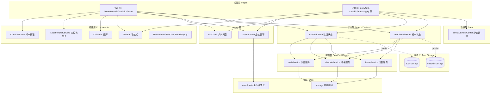

### 2.3 目录结构与职责

| 目录 | 职责 |
| ---- | ---- |
| [src/pages](file:///d:/A-Trae/T-solo/cp-008/src/pages) | 16 个页面，按业务模块组织 |
| [src/components](file:///d:/A-Trae/T-solo/cp-008/src/components) | 7 个可复用 UI 组件 |
| [src/hooks](file:///d:/A-Trae/T-solo/cp-008/src/hooks) | 时钟与定位两个核心 Hook |
| [src/store](file:///d:/A-Trae/T-solo/cp-008/src/store) | 认证与打卡两个 Zustand Store |
| [src/services](file:///d:/A-Trae/T-solo/cp-008/src/services) | auth / checkin / leave 三个服务 |
| [src/utils](file:///d:/A-Trae/T-solo/cp-008/src/utils) | storage 存储封装 / coordinate 坐标格式化 |
| [src/data](file:///d:/A-Trae/T-solo/cp-008/src/data) | 静态业务数据 |
| [src/types](file:///d:/A-Trae/T-solo/cp-008/src/types) | 全局 TypeScript 类型定义 |

### 2.4 页面路由总览

入口配置见 [app.config.ts](file:///d:/A-Trae/T-solo/cp-008/src/app.config.ts)。底部 TabBar 4 个主页面，其余为 `navigateTo` 跳转的功能页。

| 类型 | 页面 | 路由 | 入口 |
| ---- | ---- | ---- | ---- |
| Tab | 首页 | `/pages/home/index` | TabBar |
| Tab | 记录 | `/pages/records/index` | TabBar |
| Tab | 统计 | `/pages/statistics/index` | TabBar |
| Tab | 我的 | `/pages/mine/index` | TabBar |
| 功能 | 登录 | `/pages/login/index` | 重定向/退出 |
| 功能 | 外勤打卡 | `/pages/field-checkin/index` | 首页快捷入口 |
| 功能 | 请假申请 | `/pages/leave-apply/index` | 首页/我的 |
| 功能 | 请假记录 | `/pages/leave-records/index` | 我的 |
| 功能 | 打卡详情 | `/pages/record-detail/index?id=` | 记录点击 |
| 功能 | 修改密码 | `/pages/change-password/index` | 我的/设置 |
| 功能 | 帮助中心 | `/pages/help-center/index` | 我的/设置 |
| 功能 | FAQ 详情 | `/pages/help-faq-detail/index?id=` | 帮助中心 |
| 功能 | 指南详情 | `/pages/help-guide-detail/index?id=` | 帮助中心 |
| 功能 | 设置 | `/pages/settings/index` | 我的 |
| 功能 | 关于我们 | `/pages/about-us/index` | 我的/设置 |
| 功能 | 资料编辑 | `/pages/profile-edit/index` | 我的/设置 |

---

## 三、全局流程：应用生命周期与登录守卫

### 3.1 应用启动与登录态恢复流程

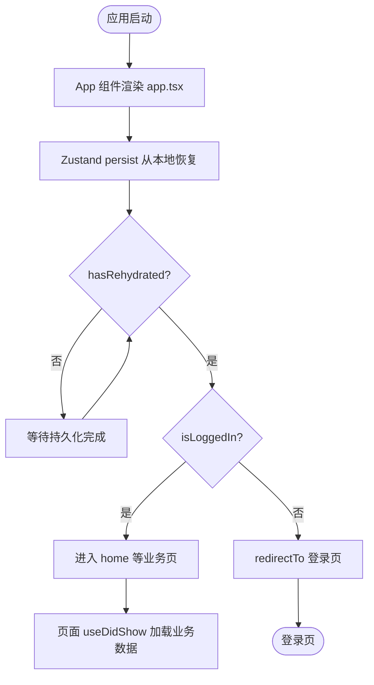

**关键节点说明：**

- **App 入口**：[app.tsx](file:///d:/A-Trae/T-solo/cp-008/src/app.tsx) 仅引入全局样式并渲染 `props.children`，本身无业务逻辑。
- **登录态恢复**：`useAuthStore` 使用 zustand `persist` 中间件，存储名 `auth-storage`。恢复完成后通过 [onRehydrateStorage](file:///d:/A-Trae/T-solo/cp-008/src/store/useAuthStore.ts#L44-L48) 回调将 `hasRehydrated` 置为 `true`，避免业务页在状态未就绪时读取到 `null`。
- **登录守卫**：每个受保护页面（home/records/statistics/mine）均在 `useEffect` 中监听 `[isLoggedIn, hasRehydrated]`，当 `hasRehydrated && !isLoggedIn` 时执行 `Taro.redirectTo({ url: '/pages/login/index' })`。

### 3.2 登录守卫统一模式

各受保护页面均遵循以下数据加载模式（以 [HomePage](file:///d:/A-Trae/T-solo/cp-008/src/pages/home/index.tsx#L67-L89) 为例）：

```typescript
// 模式：三重触发
useEffect(() => { if (hasRehydrated && isLoggedIn) loadData(); }, [isLoggedIn, hasRehydrated]);  // 首次挂载
useDidShow(() => { if (hasRehydrated && isLoggedIn) loadData(); });                                // 页面显示
useEffect(() => { if (hasRehydrated && !isLoggedIn) Taro.redirectTo(login); }, [isLoggedIn, hasRehydrated]); // 守卫
```

| 触发时机 | 钩子 | 作用 |
| ---- | ---- | ---- |
| 状态恢复完成 | `useEffect` | 初始加载业务数据 |
| 页面每次显示（含返回） | `useDidShow` | 刷新最新数据 |
| 登录态变更 | `useEffect` | 未登录则跳转登录页 |
| 下拉刷新 | `usePullDownRefresh` | 手动刷新（部分页面） |

---

## 四、各功能模块流程详解

### 4.1 认证与登录模块

#### 4.1.1 登录流程

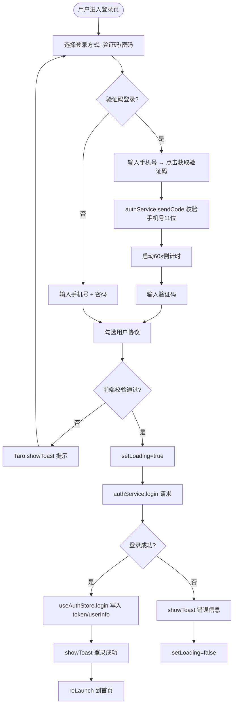

#### 4.1.2 流程要素表

| 要素 | 内容 |
| ---- | ---- |
| **触发条件** | 用户在登录页点击「登录」按钮（[handleLogin](file:///d:/A-Trae/T-solo/cp-008/src/pages/login/index.tsx#L52-L105)） |
| **输入参数** | `LoginParams { phone, loginType, password?, code? }`（类型见 [auth.ts](file:///d:/A-Trae/T-solo/cp-008/src/types/auth.ts#L11-L16)） |
| **前端校验** | 协议勾选、手机号 11 位、密码/验证码非空 |
| **服务处理** | [authService.login](file:///d:/A-Trae/T-solo/cp-008/src/services/auth.ts#L24-L45)：模拟 800ms 延迟，校验后生成 `token_xxx`，返回 mock 用户信息 |
| **状态写入** | [useAuthStore.login](file:///d:/A-Trae/T-solo/cp-008/src/store/useAuthStore.ts#L20-L27)：写入 `token`、`userInfo`、`isLoggedIn=true`，自动持久化 |
| **输出结果** | `LoginResult { token, userInfo }`；成功后 `reLaunch` 到首页 |
| **异常处理** | try/catch 捕获，`showToast` 显示 `err.message`；`finally` 中 `setLoading(false)` 防止按钮卡死 |

#### 4.1.3 验证码发送子流程

- 触发：点击「获取验证码」（[handleSendCode](file:///d:/A-Trae/T-solo/cp-008/src/pages/login/index.tsx#L24-L50)）
- 倒计时机制：60s `setInterval`，到 0 时 `clearInterval` 并重置
- 防抖：`countdown > 0` 时直接 return

#### 4.1.4 退出登录流程

| 要素 | 内容 |
| ---- | ---- |
| 触发 | 我的页点击「退出登录」（[handleLogout](file:///d:/A-Trae/T-solo/cp-008/src/pages/mine/index.tsx#L44-L63)） |
| 处理 | `showModal` 二次确认 → `authService.logout` → `useAuthStore.logout` 清空状态 → `reLaunch` 登录页 |
| 异常 | catch 后仅 `console.error`，不阻断跳转 |

---

### 4.2 打卡核心模块（上班 / 下班打卡）

打卡是系统最核心的业务流程，涉及时钟、定位、校验、服务调用、状态更新多个环节。

#### 4.2.1 首页打卡总流程

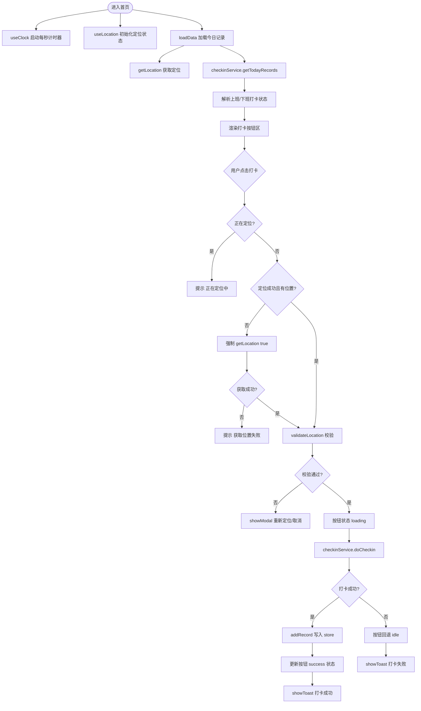

#### 4.2.2 流程要素表

| 要素 | 内容 |
| ---- | ---- |
| **触发条件** | 用户在首页点击 `CheckinButton`（[handleCheckin](file:///d:/A-Trae/T-solo/cp-008/src/pages/home/index.tsx#L91-L162)） |
| **输入参数** | `type: 'clockIn' \| 'clockOut'`，依赖当前 `location` |
| **打卡按钮状态机** | `idle → loading → success`（见 [CheckinButton](file:///d:/A-Trae/T-solo/cp-008/src/components/CheckinButton/index.tsx)） |
| **显示逻辑** | `hour < 12 \|\| !hasClockIn` 显示上班；`hour >= 12 \|\| hasClockIn` 显示下班；均完成则 disabled |
| **服务处理** | [checkinService.doCheckin](file:///d:/A-Trae/T-solo/cp-008/src/services/checkin.ts#L5-L53)：模拟 1000ms，按 9:00/18:00 判定 `late`/`early`/`success` 状态 |
| **状态更新** | [useCheckinStore.addRecord](file:///d:/A-Trae/T-solo/cp-008/src/store/useCheckinStore.ts#L41-L47)：记录同时写入 `records` 与 `todayRecords` |
| **输出结果** | `CheckinRecord` 对象；UI 更新打卡时间与状态徽标 |
| **异常处理** | catch 回退按钮状态为 `idle`；`showToast` 显示错误；定位失败提供重试入口 |

#### 4.2.3 时钟子流程（useClock）

- 位置：[useClock.ts](file:///d:/A-Trae/T-solo/cp-008/src/hooks/useClock.ts)
- 机制：`useEffect` 内 `setInterval(updateTime, 1000)`，卸载时 `clearInterval`
- 输出：`now`(dayjs对象)、`dateStr`、`timeStr`、`weekday`
- 问候语：根据 `now.hour()` 返回「早上好/上午好/中午好/下午好/晚上好/夜深了」

#### 4.2.4 定位子流程（useLocation）

定位引擎是打卡的数据基础，状态机较复杂。

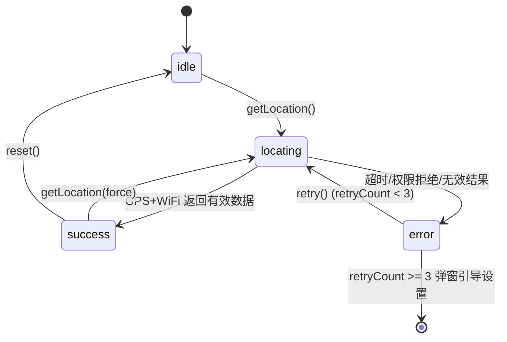

| 要素 | 内容 |
| ---- | ---- |
| **状态枚举** | `idle \| locating \| success \| error`（[LocationStatus](file:///d:/A-Trae/T-solo/cp-008/src/hooks/useLocation.ts#L5)） |
| **核心调用** | `Taro.getLocation({ type:'gcj02', isHighAccuracy:true, highAccuracyExpireTime:4000 })` |
| **超时控制** | 10s（`LOCATION_TIMEOUT`），超时主动 `clearTimeout` 并置 error |
| **WiFi 增强** | 仅微信端 `Taro.getConnectedWifi` 获取 SSID/BSSID，失败仅 warn 不阻断 |
| **防并发** | `isRequestingRef` 引用锁，进行中且非 force 时跳过 |
| **重试机制** | `MAX_RETRY_COUNT=3`，超过后 `showModal` 引导 `openSetting` |
| **校验规则** | [validateLocation](file:///d:/A-Trae/T-solo/cp-008/src/hooks/useLocation.ts#L228-L247)：精度>100 拒绝、非白名单 WiFi 拒绝 |
| **地址 mock** | 从 7 个城市地址随机取一个（实际应逆地理编码） |

---

### 4.3 外勤打卡模块

外勤打卡为独立页面，相比普通打卡增加了照片凭证与原因说明的强制要求。

#### 4.3.1 外勤打卡流程

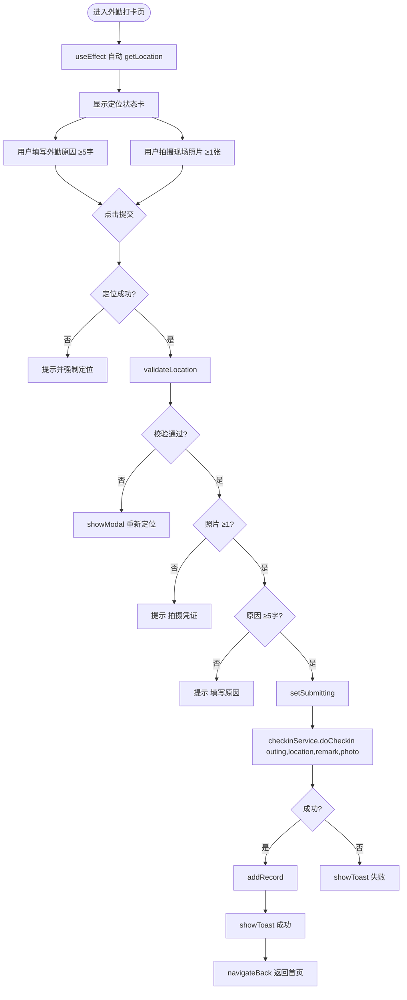

#### 4.3.2 流程要素表

| 要素 | 内容 |
| ---- | ---- |
| **触发条件** | 用户在 [FieldCheckinPage](file:///d:/A-Trae/T-solo/cp-008/src/pages/field-checkin/index.tsx) 点击「提交外勤打卡」（[handleSubmit](file:///d:/A-Trae/T-solo/cp-008/src/pages/field-checkin/index.tsx#L82-L148)） |
| **输入参数** | `type='outing'`、`location`、`remark`(≥5字)、`photoUrl`(必填) |
| **前置校验链** | 定位成功 → 位置校验 → 照片必填 → 原因必填 |
| **拍照** | `Taro.chooseImage({ sourceType:['camera'] })`，最多 3 张，压缩模式 |
| **服务处理** | [doCheckin](file:///d:/A-Trae/T-solo/cp-008/src/services/checkin.ts#L13-L15)：外勤必须照片，否则抛错；状态固定 `outing` |
| **提交条件** | `canSubmit = isSuccess && location && remark≥5 && photos>0 && !submitting` |
| **输出结果** | 外勤 `CheckinRecord` 写入 store，1s 后 `navigateBack` |
| **异常处理** | 全链路 try/catch；`loadingOverlay` 遮罩防重复提交 |

---

### 4.4 请假管理模块

#### 4.4.1 请假申请流程

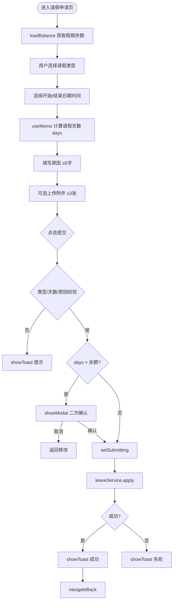

#### 4.4.2 请假申请要素表

| 要素 | 内容 |
| ---- | ---- |
| **触发条件** | [LeaveApplyPage](file:///d:/A-Trae/T-solo/cp-008/src/pages/leave-apply/index.tsx) 点击「提交申请」（[handleSubmit](file:///d:/A-Trae/T-solo/cp-008/src/pages/leave-apply/index.tsx#L83-L140)） |
| **输入参数** | `LeaveApplyParams { type, startDate, endDate, startTime, endTime, reason, attachmentUrl? }` |
| **请假类型** | 7 种：年假/病假/事假/婚假/产假/陪产假/其他（[leaveTypeOptions](file:///d:/A-Trae/T-solo/cp-008/src/types/leave.ts#L33-L41)） |
| **天数计算** | `end.diff(start,'hour')/8`，保留 1 位小数；结束日期早于开始则提示 |
| **余额超限** | `balance>0 && days>balance` 时弹窗二次确认 |
| **服务处理** | [leaveService.apply](file:///d:/A-Trae/T-solo/cp-008/src/services/leave.ts#L5-L45)：模拟 1000ms，原因<5 字抛错，生成 `LV{id}` 记录，状态 `pending` |
| **输出结果** | `LeaveRecord`，状态待审批 |
| **异常处理** | try/catch + finally 释放 submitting |

#### 4.4.3 请假记录与撤销流程

| 要素 | 内容 |
| ---- | ---- |
| **页面** | [LeaveRecordsPage](file:///d:/A-Trae/T-solo/cp-008/src/pages/leave-records/index.tsx) |
| **筛选** | 4 个 Tab：全部/待审批/已通过/已拒绝；前端 `filter` 二次过滤 |
| **数据加载** | [leaveService.getRecords](file:///d:/A-Trae/T-solo/cp-008/src/services/leave.ts#L47-L104) 返回 mock 3 条记录 |
| **撤销** | 仅 `pending` 可撤销；`showModal` 确认 → [leaveService.cancel](file:///d:/A-Trae/T-solo/cp-008/src/services/leave.ts#L132-L135) → 重新 `loadData` |
| **刷新机制** | `useEffect`(filter 变更) + `useDidShow` + `usePullDownRefresh` |

---

### 4.5 打卡记录模块

#### 4.5.1 记录页流程

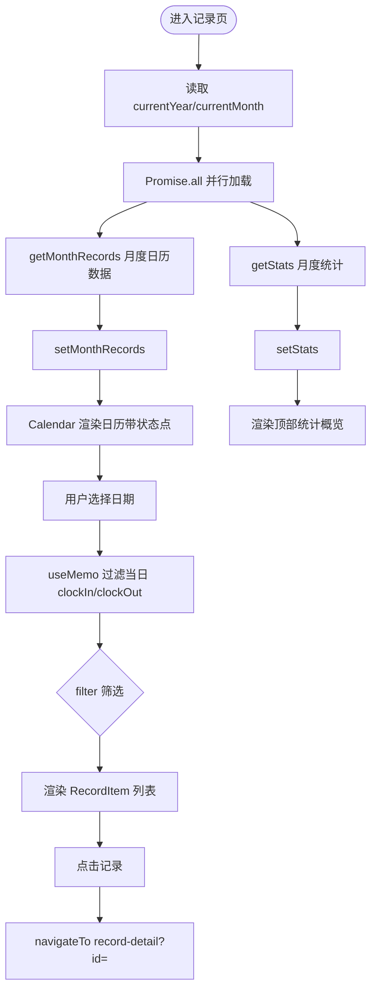

#### 4.5.2 记录页要素表

| 要素 | 内容 |
| ---- | ---- |
| **页面** | [RecordsPage](file:///d:/A-Trae/T-solo/cp-008/src/pages/records/index.tsx) |
| **触发加载** | 月份切换 / `useDidShow` / 下拉刷新 |
| **并行请求** | `Promise.all([getMonthRecords, getStats])`，任一失败整体 `showToast` |
| **日历组件** | [Calendar](file:///d:/A-Trae/T-solo/cp-008/src/components/Calendar/index.tsx)：6×7 网格，含上下月填充，状态点颜色映射 |
| **筛选** | 6 类：全部/异常/迟到/早退/缺勤/外勤 |
| **月份导航** | 跨年处理（1月↔12月），「今天」快捷回到当月当日 |

#### 4.5.3 打卡详情流程

| 要素 | 内容 |
| ---- | ---- |
| **页面** | [RecordDetailPage](file:///d:/A-Trae/T-solo/cp-008/src/pages/record-detail/index.tsx) |
| **入参** | `router.params.id`（路由参数） |
| **数据来源** | 优先从 `useCheckinStore.records` 查找 → 回退 `getTodayRecords` → 兜底 mock |
| **坐标展示** | [formatCoordinates](file:///d:/A-Trae/T-solo/cp-008/src/utils/coordinate.ts) 输出十进制/度分秒/带方向多格式 |
| **时间差计算** | `calculateTimeDiff` 计算迟到/早退分钟数 |
| **状态分支** | loading → error/空 → 正常渲染三态 |

---

### 4.6 统计分析模块

#### 4.6.1 统计页流程

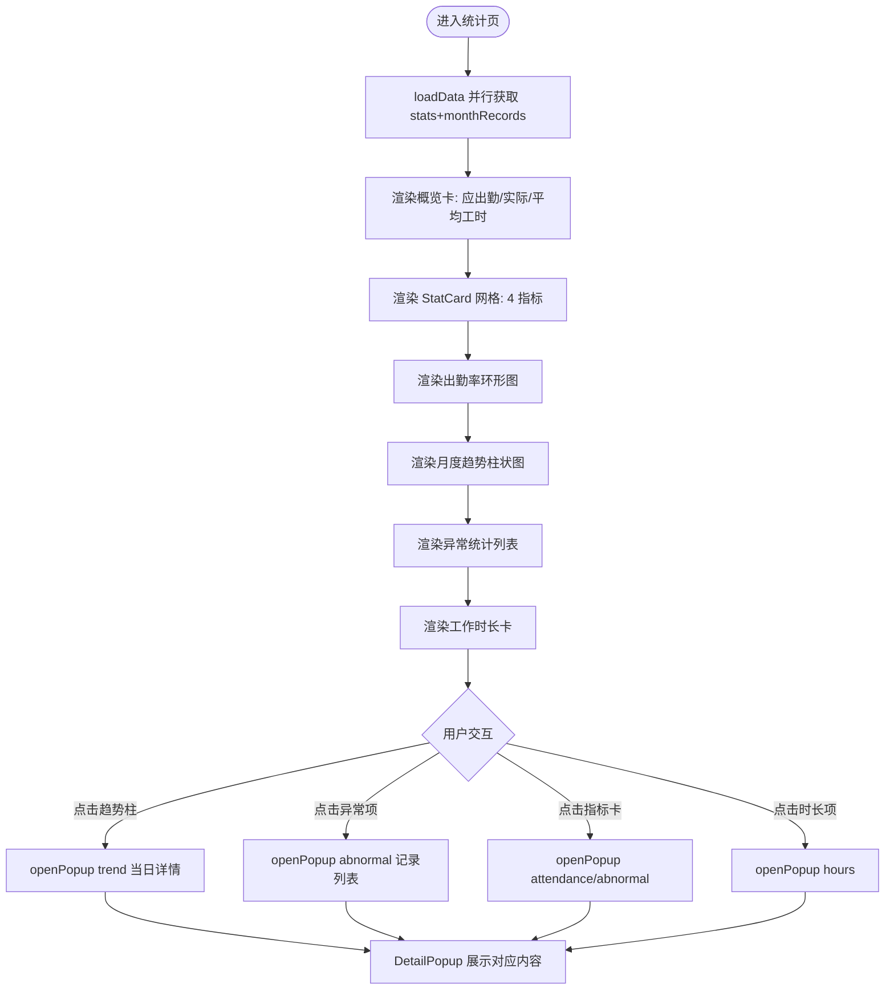

#### 4.6.2 统计页要素表

| 要素 | 内容 |
| ---- | ---- |
| **页面** | [StatisticsPage](file:///d:/A-Trae/T-solo/cp-008/src/pages/statistics/index.tsx) |
| **Popup 模式** | `trend \| abnormal \| attendance \| hours` 四种详情弹窗 |
| **派生计算** | 趋势高度映射、异常占比百分比、加班时长、是否达标均由 `useMemo` 派生 |
| **月份限制** | 下月按钮在当月时禁用（opacity 0.3） |
| **详情加载** | 模拟 200ms `loadingDetail` 后打开 Popup |

---

### 4.7 个人中心与设置模块

#### 4.7.1 个人资料编辑流程

| 要素 | 内容 |
| ---- | ---- |
| **页面** | [ProfileEditPage](file:///d:/A-Trae/T-solo/cp-008/src/pages/profile-edit/index.tsx) |
| **表单字段** | 姓名/手机号/部门/职位/头像（工号只读） |
| **校验** | 姓名 2-20 字、手机号正则、部门/职位必选 |
| **头像** | `Taro.chooseImage` 相册/相机，单张压缩 |
| **提交流程** | `validateForm` → [authService.updateProfile](file:///d:/A-Trae/T-solo/cp-008/src/services/auth.ts#L134-L159) → `updateUserInfo` 同步 store → `showModal` 成功 → `navigateBack` |
| **实时校验** | 输入时清除对应字段错误；`canSubmit` useMemo 联动按钮 |

#### 4.7.2 修改密码流程

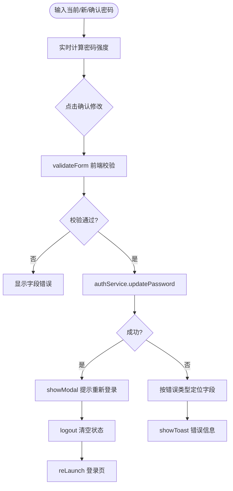

| 要素 | 内容 |
| ---- | ---- |
| **页面** | [ChangePasswordPage](file:///d:/A-Trae/T-solo/cp-008/src/pages/change-password/index.tsx) |
| **密码规则** | 8-20 位、无空格、4 类字符≥3 类、不与旧密码相同、相似度<60%、非常见弱密码 |
| **强度评估** | `passwordStrength` useMemo：弱/中/强三档 |
| **服务校验** | [updatePassword](file:///d:/A-Trae/T-solo/cp-008/src/services/auth.ts#L66-L126) 多重校验，mock 当前密码 `123456` |
| **错误归因** | catch 中按 message 关键字判断归属 `oldPassword` 还是 `newPassword` 字段 |
| **成功后置** | 强制 logout 重新登录，保障安全 |

#### 4.7.3 设置与其他

| 功能 | 入口 | 处理 |
| ---- | ---- | ---- |
| 设置页 | [SettingsPage](file:///d:/A-Trae/T-solo/cp-008/src/pages/settings/index.tsx) | 菜单跳转中枢 |
| 清除缓存 | 设置页 | `Taro.clearStorage()` 清空所有本地存储 |
| 检查更新 | 设置页 | 模拟 1000ms 后提示「已是最新版本」 |
| 关于我们 | [AboutUsPage](file:///d:/A-Trae/T-solo/cp-008/src/pages/about-us/index.tsx) | 纯展示，含复制文本/拨打电话/团队弹窗 |

---

### 4.8 帮助中心模块

#### 4.8.1 帮助中心流程

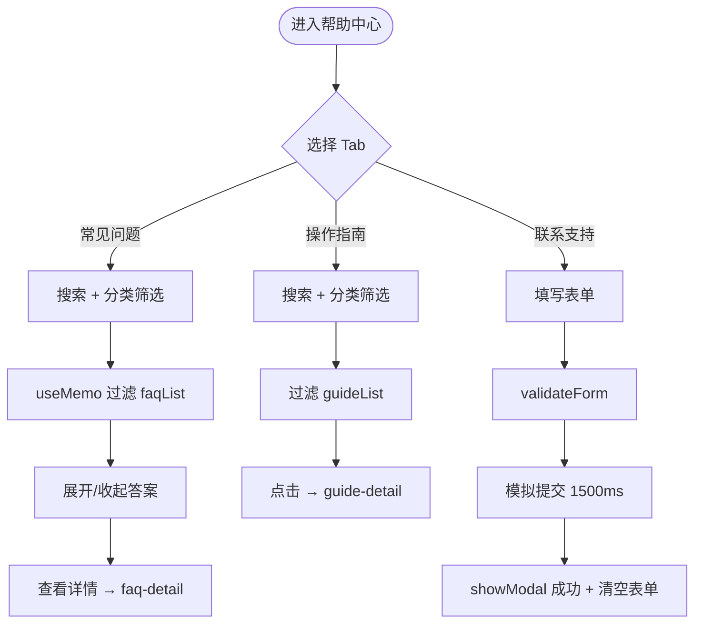

#### 4.8.2 FAQ 详情流程

| 要素 | 内容 |
| ---- | ---- |
| **页面** | [HelpFaqDetailPage](file:///d:/A-Trae/T-solo/cp-008/src/pages/help-faq-detail/index.tsx) |
| **入参** | `router.params.id` |
| **数据来源** | 静态 [faqList](file:///d:/A-Trae/T-solo/cp-008/src/data/helpCenter.ts) 内存查找 |
| **有用反馈** | `helpfulStatus` 状态机，支持切换，维护 `yesCount/noCount` |
| **相关问题** | 同分类取前 5 条，`redirectTo` 切换 |

#### 4.8.3 指南详情流程

| 要素 | 内容 |
| ---- | ---- |
| **页面** | [HelpGuideDetailPage](file:///d:/A-Trae/T-solo/cp-008/src/pages/help-guide-detail/index.tsx) |
| **学习进度** | `completedSteps` 数组，`Taro.setStorageSync('guide_{id}')` 持久化 |
| **步骤标记** | 点击步骤序号切换完成态，计算进度百分比 |
| **重置进度** | `showModal` 确认 → 清空数组 + `removeStorageSync` |

---

## 五、数据流转与状态管理

### 5.1 全局状态 Store 设计

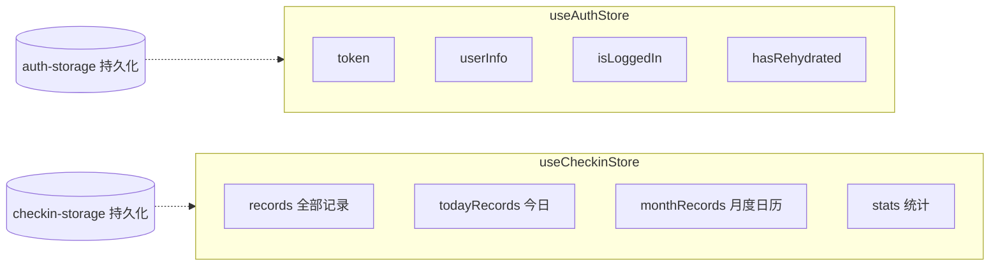

| Store | 持久化名 | 持久化内容 | 恢复回调 |
| ---- | ---- | ---- | ---- |
| [useAuthStore](file:///d:/A-Trae/T-solo/cp-008/src/store/useAuthStore.ts) | `auth-storage` | token/userInfo/isLoggedIn | `onRehydrateStorage` 置 `hasRehydrated=true` |
| [useCheckinStore](file:///d:/A-Trae/T-solo/cp-008/src/store/useCheckinStore.ts) | `checkin-storage` | records/todayRecords/monthRecords/stats | 无特殊回调 |

### 5.2 典型数据流转路径

**打卡数据流（写入）：**
```
用户操作 → HomePage.handleCheckin → checkinService.doCheckin(Mock) 
→ useCheckinStore.addRecord → 更新 records + todayRecords 
→ 持久化到 checkin-storage → UI 响应式更新
```

**统计数据流（读取）：**
```
StatisticsPage.loadData → Promise.all[getStats, getMonthRecords](Mock) 
→ useCheckinStore.setStats/setMonthRecords → useMemo 派生趋势/异常/工时 
→ DetailPopup 渲染
```

**认证数据流：**
```
LoginPage.handleLogin → authService.login(Mock) 
→ useAuthStore.login → 持久化 auth-storage 
→ 各页面 useEffect 监听 isLoggedIn 守卫
```

---

## 六、公共机制

### 6.1 本地存储机制（utils/storage）

[storage](file:///d:/A-Trae/T-solo/cp-008/src/utils/storage.ts) 对 `Taro.setStorage/getStorage` 封装，统一 JSON 序列化与异常兜底。

| 方法 | 行为 | 异常处理 |
| ---- | ---- | ---- |
| `set(key, value)` | 非字符串 JSON.stringify 后存储 | catch `console.error`，不抛错 |
| `get<T>(key)` | 尝试 JSON.parse，失败返回原值 | catch 返回 `null` |
| `remove(key)` | 删除指定 key | catch `console.error` |
| `clear()` | 清空全部存储 | catch `console.error` |

> 注意：Zustand persist 与 `storage` 工具是两套独立机制。persist 自动管理 store 持久化；`storage` 供指南进度等零散场景使用。设置页「清除缓存」调用 `Taro.clearStorage()` 会同时清空两者。

### 6.2 坐标格式化机制（utils/coordinate）

[coordinate.ts](file:///d:/A-Trae/T-solo/cp-008/src/utils/coordinate.ts) 提供经纬度多格式输出，服务于打卡详情与定位卡的坐标展示。

| 函数 | 输出格式 |
| ---- | ---- |
| `formatLatitude(lat)` | 十进制 / 度分秒(DMS) / 带方向 / 全标签 |
| `formatLongitude(lng)` | 同上，方向为 E/W |
| `formatCoordinates(lat,lng,opts)` | 组合输出，支持 showDms/showDirection 开关 |
| `padCoordinate(value,isLat)` | 整数位补零（纬 2 位、经 3 位） |

### 6.3 导航栏机制（components/NavBar）

[NavBar](file:///d:/A-Trae/T-solo/cp-008/src/components/NavBar/index.tsx) 自定义导航，适配状态栏高度。

- 高度：`Taro.getSystemInfoSync().statusBarHeight` 动态 padding
- 返回逻辑：优先 `onBack` 回调 → `getCurrentPages` 判断栈深 → 栈深≤1 时 `switchTab` 首页兜底 → `navigateBack` 失败也兜底首页

### 6.4 组件复用关系

| 组件 | 复用页面 | 职责 |
| ---- | ---- | ---- |
| [CheckinButton](file:///d:/A-Trae/T-solo/cp-008/src/components/CheckinButton/index.tsx) | home | 打卡按钮三态 |
| [LocationStatusCard](file:///d:/A-Trae/T-solo/cp-008/src/components/LocationStatusCard/index.tsx) | home, field-checkin | 定位四态展示 + 坐标 |
| [Calendar](file:///d:/A-Trae/T-solo/cp-008/src/components/Calendar/index.tsx) | records | 月历 + 状态点 |
| [NavBar](file:///d:/A-Trae/T-solo/cp-008/src/components/NavBar/index.tsx) | 所有功能页 | 自定义导航栏 |
| [RecordItem](file:///d:/A-Trae/T-solo/cp-008/src/components/RecordItem/index.tsx) | home, records | 打卡记录条目 |
| [StatCard](file:///d:/A-Trae/T-solo/cp-008/src/components/StatCard/index.tsx) | statistics | 统计指标卡 |
| [DetailPopup](file:///d:/A-Trae/T-solo/cp-008/src/components/DetailPopup/index.tsx) | statistics | 详情弹窗 |

---

## 七、异常处理机制汇总

### 7.1 异常处理分层策略

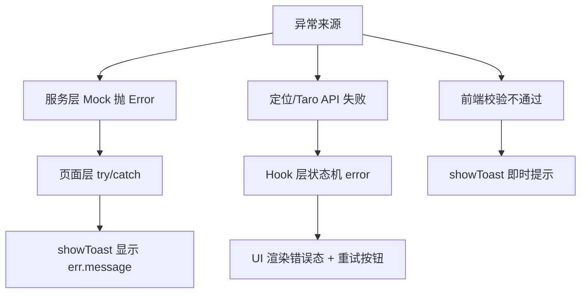

### 7.2 各模块异常处理对照

| 模块 | 异常类型 | 处理方式 | 用户感知 |
| ---- | ---- | ---- | ---- |
| 登录 | 服务抛错/校验失败 | `showToast` + 按钮 loading 释放 | 错误提示 |
| 打卡 | 定位失败 | 状态机 `error` + 重试按钮 + 3 次上限引导设置 | 错误卡 + 重试 |
| 打卡 | 校验不通过 | `showModal` 重新定位/取消 | 弹窗引导 |
| 打卡 | 服务失败 | 按钮回退 idle + `showToast` | 错误提示 |
| 外勤 | 定位/照片/原因缺失 | 逐项 `showToast` + `canSubmit` 禁用按钮 | 按钮禁用 + 提示 |
| 请假 | 余额超限 | `showModal` 二次确认 | 确认弹窗 |
| 记录/统计 | 加载失败 | `showToast` 加载失败 | 错误提示 |
| 详情 | 记录不存在 | 兜底 mock + error 态重试按钮 | 错误页 + 重试 |
| 修改密码 | 字段错误 | 按关键字归因到具体字段 | 字段级红字 |
| 定位 | 超时 | 10s 主动 `clearTimeout` 置 error | 超时提示 |
| 定位 | 权限拒绝 | 错误码映射 + 3 次后 `openSetting` | 引导设置 |
| 存储 | 读写失败 | catch `console.error/warn` 静默 | 无感知（降级） |

### 7.3 定位错误码映射表

[getErrorMessage](file:///d:/A-Trae/T-solo/cp-008/src/hooks/useLocation.ts#L28-L49) 的错误码映射：

| 错误码 | 含义 | 用户提示 |
| ---- | ---- | ---- |
| 1 | 权限拒绝 | 请在设置中开启定位权限 |
| 2 | 无法获取 | 检查 GPS 或网络连接 |
| 3 | 超时 | 定位请求超时，请重试 |
| 4 | 服务不可用 | 系统定位服务不可用 |
| 11 | 结果无效 | 定位结果无效，请重试 |
| 12 | 精度不足 | 在开阔地带重试 |
| -1 | 未知 | 获取位置信息失败，请重试 |

---

## 八、模块间交互关系总览

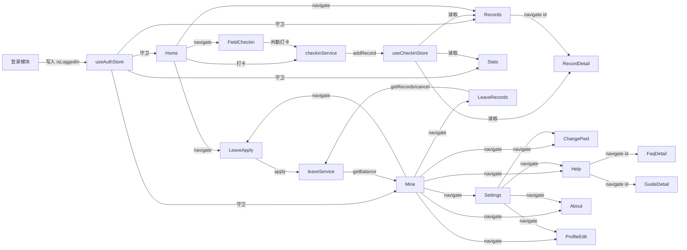

### 交互要点

1. **认证状态是全局枢纽**：`useAuthStore.isLoggedIn` 驱动所有受保护页面的守卫与数据加载。
2. **打卡 Store 是数据中枢**：写入端（home/field-checkin）与读取端（records/statistics/record-detail）通过 `useCheckinStore` 解耦。
3. **我的页是功能入口**：聚合请假、设置、帮助、关于等入口，承担导航中枢角色。
4. **服务层可替换**：所有 `services/*.ts` 为 Mock 实现，后端接入时仅需替换服务层，视图/Hook/Store 无需改动。

---

## 九、附录：关键业务规则

### 9.1 打卡状态判定规则（[checkinService.doCheckin](file:///d:/A-Trae/T-solo/cp-008/src/services/checkin.ts#L19-L36)）

| 打卡类型 | 标准时间 | 判定逻辑 | 结果状态 |
| ---- | ---- | ---- | ---- |
| clockIn 上班 | 09:00 | `now.diff(09:00) > 0` | late 迟到 / success 正常 |
| clockOut 下班 | 18:00 | `18:00.diff(now) > 0` | early 早退 / success 正常 |
| outing 外勤 | — | 固定 | outing |

### 9.2 定位校验规则（[validateLocation](file:///d:/A-Trae/T-solo/cp-008/src/hooks/useLocation.ts#L228-L247)）

| 条件 | 阈值 | 结果 |
| ---- | ---- | ---- |
| 无位置信息 | — | 不通过 |
| 精度 accuracy | > 100 米 | 不通过（GPS 信号差） |
| WiFi 名称 | 非白名单(Company-WiFi/Office-WiFi) | 不通过（需连公司 WiFi） |
| 其他 | — | 通过 |

### 9.3 密码强度规则（[updatePassword](file:///d:/A-Trae/T-solo/cp-008/src/services/auth.ts#L66-L126)）

- 长度 8-20 位，不含空格
- 4 类字符（大写/小写/数字/特殊）至少含 3 类
- 不与旧密码相同，相似度 < 60%
- 非常见弱密码（12345678 等）
- Mock 当前密码校验值：`123456`

---

*文档生成日期：2026-06-17 · 基于 Taro 4.1.9 + React 18 + Zustand 4.5*
